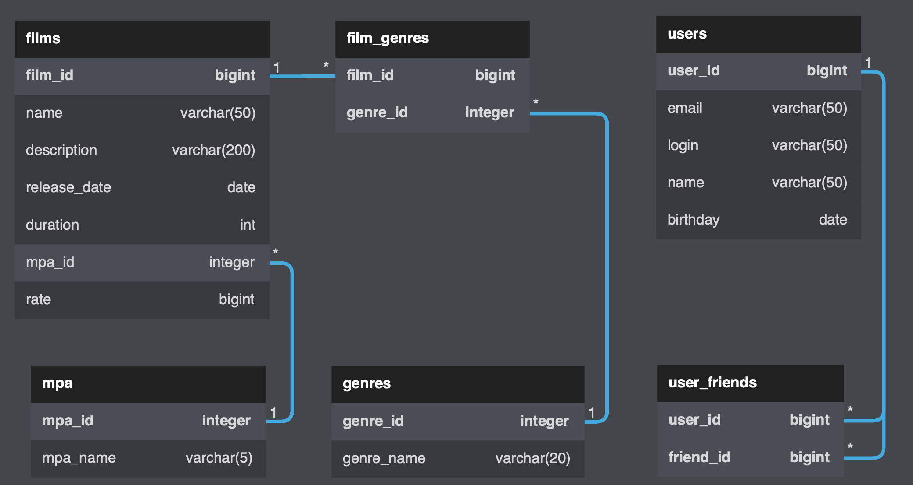

# _Java-filmorate_

### _Description_
The service works with films and it`s ranking. It returns top 5 films with the highest rate. Backend.

### _Technologies_
Spring-Boot (2.6.7), jdbc, h2 (2.1.212), java (sdk 11), lombok (1.18.24)

### _Structure_
The module contains of the main service and embedded H2 database.

[Filmorate API (Swagger)](https://petstore.swagger.io?url=)

### _Entity relationship_

### _Starting the service_
CLI start commands:  
`mvn package`  
`cd target`  
`java -jar filmorate-0.0.1-SNAPSHOT.jar`

___
### _Update history_ 

## *`Sprint 4`*
#### *- Refactor ER*
#### *- Refactor User model and Film model*
#### *- Add Genre Model and Mpa Model*
#### *- Add H2 database support*
#### *- Add Genre Controller and Mpa Controller*
#### *- Add Genre Service and Mpa Service*
#### *- Add Genre DAO and Mpa DAO*
#### *- Add User DAO and Film DAO*
#### *- Add RuntimeExceptions: GenreNotExistException, MpaNotExistException, SqlExceptionFilmorate*
#### *- Add endpoints GET /genres, GET /genres/{id}, GET /mpa, GET /mpa/{id}tests*
#### *- Add tests for endpoints GET /genres, GET /genres/{id}, GET /mpa, GET /mpa/{id} tests*
#### *- Add DAO tests*

___

### *`Sprint 3`*
##### *- Add ER*
##### 
##### *- Requests examples:*
- *Update user:*     
  `UPDATE users`
  `SET email=?,`
  `login=?,`
  `name=?,`
  `birthday=?`
  `WHERE user_id=?;`
- *Insert Genres:*     
  `INSERT INTO film_genres (film_id, genre_id)`
  `VALUES (?, ?);`
- *Add Film:*     
  `INSERT INTO films (name, description, release_date`
  `, duration, mpa_id, rate)`
  `VALUES ( ?, ?, ?, ?, ?, ?);`
- *Get Genres List:*   
  `SELECT film_id, genre_name, genres.genre_id `   
  `FROM film_genres`  
  `LEFT JOIN genres ON film_genres.genre_id = genres.genre_id `   
  `WHERE film_id=? `
  `ORDER BY genre_id;`

___

### *`Sprint 2`*
##### *- Add interfaces FilmStorage & UserStorage*
##### *- Add classes InMemoryFilmStorage & InMemoryUserStorage*
##### *- Refactor classes FilmController & UserController*
##### *- Add classes FilmService & UserService*
##### *- Refactor exception handlers*
##### *- Add integration tests*

---

### *`Sprint 1`*
##### *- Add Spring Boot (Web)*
##### *- Add model classes User and Film*
##### *- Add controllers*
##### *- Add constrains*
##### *- Add data validation*
##### *- Add REST API Tests*
##### *- Add logging*
##### *- Add ExceptionHandlers*
